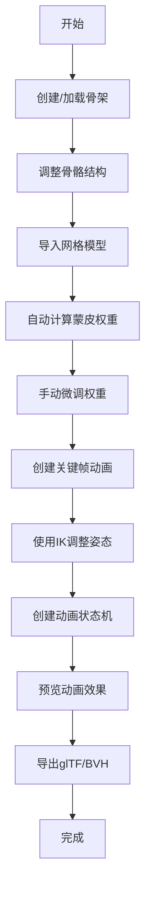

## 1. 产品概述

WebGL骨骼动画编辑与蒙皮渲染工具，面向游戏开发者、动画师和3D艺术家，提供完整的骨骼动画创作工作流。在浏览器中即可完成骨架创建、网格绑定、关键帧动画编辑、IK求解、动画状态机混合等专业功能，无需安装重型软件。

核心价值：降低3D骨骼动画制作门槛，提供从骨架到动画导出的一站式解决方案，支持glTF和BVH等行业标准格式。

## 2. 核心功能

### 2.1 用户角色
| 角色 | 注册方式 | 核心权限 |
|------|----------|----------|
| 普通用户 | 无需注册，直接使用 | 创建/编辑骨架、导入网格、制作动画、导出文件 |
| 专业用户 | 无需注册 | 使用高级IK功能、动画状态机、批量导出 |

### 2.2 功能模块
1. **主编辑界面**: 3D视口、工具栏、属性面板、时间轴
2. **骨架编辑模块**: 关节创建、父子连接、旋转调整、层级管理、人形预设
3. **网格蒙皮模块**: OBJ导入、自动权重计算、权重绘制、权重热力图
4. **关键帧动画模块**: 时间轴编辑、关键帧管理、插值控制、洋葱皮、播放控制
5. **IK逆运动学模块**: FABRIK求解、旋转约束、FK/IK切换
6. **动画状态机模块**: 状态节点、转换条件、动画混合、参数控制
7. **渲染模块**: GPU蒙皮、多种渲染模式、相机控制、辅助显示
8. **导入导出模块**: glTF导入导出、BVH导出、预设动画模板

### 2.3 页面详情
| 页面名称 | 模块名称 | 功能描述 |
|----------|----------|----------|
| 主编辑页 | 3D视口 | 显示场景、骨骼、网格，支持点击创建关节、拖拽操作 |
| 主编辑页 | 顶部工具栏 | 操作模式切换（创建/选择/旋转/权重绘制）、视图切换、渲染模式 |
| 主编辑页 | 右侧面板 | 骨骼层级树、属性编辑、IK设置、状态机面板（标签页切换） |
| 主编辑页 | 底部时间轴 | 帧刻度、骨骼轨道、关键帧标记、播放控制条 |
| 主编辑页 | 导入导出对话框 | 文件选择、格式选项、导出配置 |

## 3. 核心流程

**典型工作流程**:
1. 用户进入应用，选择人形骨架预设或从零创建骨架
2. 在3D视口中调整关节位置和旋转，构建骨架结构
3. 导入OBJ网格文件，系统自动计算蒙皮权重
4. 切换到权重绘制模式，手动调整顶点权重
5. 在时间轴上创建关键帧，逐帧调整骨骼姿势
6. 使用IK功能调整末端关节，自动计算中间姿态
7. 创建多个动画片段，设置状态机转换逻辑
8. 预览动画效果，导出为glTF或BVH格式

## 4. 用户界面设计

### 4.1 设计风格
- **设计方向**: 专业DCC（数字内容创作）工具风格，深色主题，强调功能性和操作效率
- **主色调**: 深空灰 `#1a1a2e`，深蓝 `#16213e`，专业感强
- **强调色**: 科技蓝 `#00d4ff`，用于高亮选中和交互反馈
- **辅助色**: 骨骼线框 `#ff6b6b`，权重热力图蓝到红渐变
- **按钮风格**: 扁平风格，轻微圆角，选中状态有蓝色边框
- **字体**: JetBrains Mono 作为等宽字体用于数值输入，Inter 用于界面文本
- **布局**: 典型DCC布局，中央大视口，右侧属性面板，底部时间轴，顶部工具栏
- **图标风格**: 细线SVG图标，与专业3D软件风格一致

### 4.2 页面设计概述
| 页面名称 | 模块名称 | UI元素 |
|----------|----------|--------|
| 主编辑页 | 3D视口 | 中央占比60%，深色背景，网格地面，坐标轴，骨骼锥形，半透明网格 |
| 主编辑页 | 右侧面板 | 宽度320px，标签页切换（层级/属性/IK/状态机），树状结构可折叠 |
| 主编辑页 | 底部时间轴 | 高度200px，帧刻度网格，多轨道布局，关键帧菱形标记 |
| 主编辑页 | 顶部工具栏 | 高度48px，图标按钮组，模式切换高亮，下拉菜单 |

### 4.3 响应性
- 桌面端优先设计，最低分辨率1280x800
- 面板可拖拽调整宽度，支持折叠收起
- 时间轴可垂直展开显示更多轨道
- 触摸屏支持双指缩放和旋转视角

### 4.4 3D场景指导
- **环境**: 深色背景 `#0f0f1a`，无HDRI，突出骨骼和网格显示
- **光照**: 两盏方向光（主光+补光）+ 环境光，均匀照明便于观察
- **相机**: 轨道控制器，默认45度俯视角，支持正交/透视切换
- **合成**: 骨骼叠加在网格上层，选中骨骼高亮发光
- **后期**: 轻微泛光效果用于选中高亮，抗锯齿开启
- **性能预算**: 目标60fps，骨骼数量上限100，网格顶点上限50000
