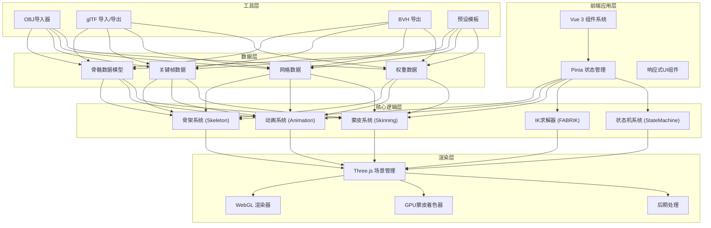
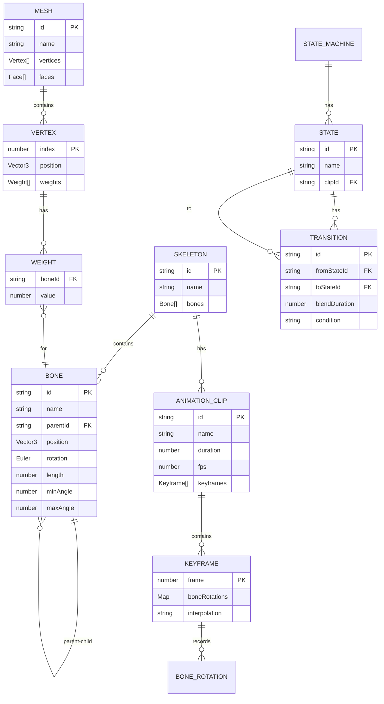

## 1. 架构设计



## 2. 技术描述

- **前端框架**: Vue 3.4 + TypeScript 5.4 + Vite 5.2
- **状态管理**: Pinia 2.1
- **UI组件**: 自定义组件 + TailwindCSS 3.4
- **3D渲染**: Three.js 0.162
- **图标**: Lucide Vue Next
- **数据持久化**: LocalStorage 存储项目状态
- **构建工具**: Vite 5.2
- **代码规范**: ESLint + Prettier

## 3. 目录结构

```
src/
├── components/              # Vue组件
│   ├── viewport/           # 3D视口组件
│   ├── toolbar/            # 顶部工具栏
│   ├── panels/             # 右侧面板
│   │   ├── HierarchyPanel.vue
│   │   ├── PropertiesPanel.vue
│   │   ├── IkPanel.vue
│   │   └── StateMachinePanel.vue
│   ├── timeline/           # 时间轴组件
│   └── dialogs/            # 对话框组件
├── composables/            # Vue组合式函数
│   ├── useSkeleton.ts
│   ├── useAnimation.ts
│   ├── useSkinning.ts
│   ├── useIK.ts
│   └── useRender.ts
├── core/                   # 核心逻辑(TypeScript类)
│   ├── skeleton/           # 骨架系统
│   │   ├── Bone.ts
│   │   ├── Skeleton.ts
│   │   └── HumanoidPreset.ts
│   ├── animation/          # 动画系统
│   │   ├── Keyframe.ts
│   │   ├── AnimationClip.ts
│   │   ├── Animator.ts
│   │   └── StateMachine.ts
│   ├── ik/                 # IK系统
│   │   ├── FabrikSolver.ts
│   │   └── RotationConstraint.ts
│   ├── skinning/           # 蒙皮系统
│   │   ├── WeightCalculator.ts
│   │   └── WeightPainter.ts
│   └── io/                 # 导入导出
│       ├── ObjImporter.ts
│       ├── GltfIO.ts
│       └── BvhExporter.ts
├── stores/                 # Pinia stores
│   ├── useSkeletonStore.ts
│   ├── useAnimationStore.ts
│   ├── useViewportStore.ts
│   └── useProjectStore.ts
├── shaders/                # GLSL着色器
│   ├── skinningVertex.glsl
│   └── weightFragment.glsl
├── types/                  # TypeScript类型定义
│   ├── index.ts
│   ├── skeleton.ts
│   ├── animation.ts
│   └── skinning.ts
├── utils/                  # 工具函数
│   ├── math.ts
│   ├── threeHelpers.ts
│   └── constants.ts
├── App.vue
└── main.ts
```

## 4. 路由定义

| 路由 | 用途 |
|------|------|
| `/` | 主编辑页面，包含所有功能模块 |
| `/help` | 帮助文档页面（可选） |

## 5. 数据模型

### 5.1 数据模型定义



### 5.2 核心类型定义

```typescript
// skeleton.ts
interface BoneData {
  id: string;
  name: string;
  parentId: string | null;
  position: [number, number, number];
  rotation: [number, number, number];
  length: number;
  minAngle?: number;
  maxAngle?: number;
}

interface SkeletonData {
  id: string;
  name: string;
  bones: BoneData[];
  rootBoneId: string;
}

// animation.ts
interface KeyframeData {
  frame: number;
  boneRotations: Record<string, [number, number, number]>;
  interpolation: 'linear' | 'bezier';
  bezierHandles?: Record<string, [[number, number, number], [number, number, number]]>;
}

interface AnimationClipData {
  id: string;
  name: string;
  fps: number;
  duration: number;
  keyframes: KeyframeData[];
}

interface StateData {
  id: string;
  name: string;
  clipId: string;
  speed: number;
}

interface TransitionData {
  id: string;
  fromStateId: string;
  toStateId: string;
  blendDuration: number;
  condition: string;
}

interface StateMachineData {
  id: string;
  states: StateData[];
  transitions: TransitionData[];
  parameters: Record<string, boolean | number>;
  initialStateId: string;
}

// skinning.ts
interface VertexData {
  position: [number, number, number];
  normal?: [number, number, number];
  weights: Array<{ boneId: string; value: number }>;
}

interface MeshData {
  id: string;
  name: string;
  vertices: VertexData[];
  faces: Array<[number, number, number]>;
}

// project.ts
interface ProjectData {
  version: string;
  skeleton: SkeletonData;
  mesh?: MeshData;
  animationClips: AnimationClipData[];
  stateMachine?: StateMachineData;
  createdAt: string;
  updatedAt: string;
}
```

## 6. 核心算法说明

### 6.1 FABRIK IK算法
- 前向传递: 从末端关节向根关节移动，保持骨骼长度
- 后向传递: 从根关节向末端关节移动，保持骨骼长度
- 迭代直到末端误差 < 阈值(1e-3)或达到最大迭代数(10)
- 每步应用旋转约束

### 6.2 蒙皮权重计算
- 对每个顶点，计算到所有骨骼的距离
- 使用热扩散公式: weight = exp(-distance² / (2σ²))
- 取权重最大的4根骨骼，归一化到总和为1

### 6.3 三次贝塞尔插值
- 使用四元数球面插值(Slerp)进行旋转插值
- 关键帧句柄控制切线方向和插值曲线

### 6.4 GPU蒙皮
- 顶点着色器中构建骨骼矩阵调色板
- 每个顶点最多4个骨骼矩阵加权混合
- 矩阵变换在GPU并行计算
